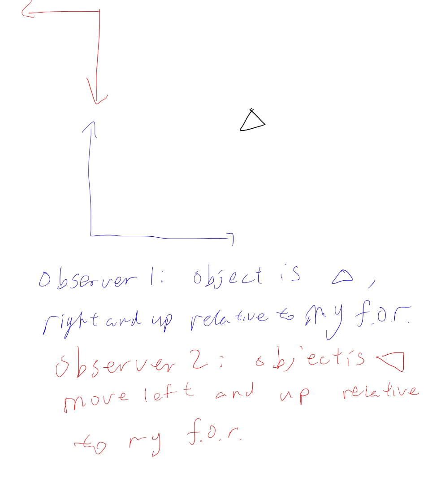

# Frame of Reference project script and notes

###### This file serves to allow for visualisation before coding the animations, please place your pictures in ./assets/notes/

## Introduction

Hello everyone, in this video we are going to attempt to explain the concept of a reference frame.

```python
class SelfIntroduction(Scene)
```


First of all, a reference frame is composed of an origin and methods of describing the position and orientation of an object relative to the origin. A frame of reference seeks to systematically answer the question of where something is in time and space. Also please note that for this video, the observer is placed at the origin for ease. An observer can also be a certain distance away from the origin.

```python
class ReferenceFrameDefWords(Scene)
```


As an example, this moving green point can be described by saying it is a at a position of x from the origin's x axis and a position of y from the origin's y axis, of course assuming that the right direction indicates a positive . This is known as a Cartesian coordinate system.

```python
class ReferenceFrameExample(Scene)
```


For the purposes of this video, we are only going to explain what is known as inertial reference frames. Inertial reference frames are frames of references in which itself is not experiencing a force, or "pushes and pulls". For example, if your reference frame is a car moving at a constant velocity, then that is an inertial reference frame. However, a car that is speeding up or slowing down is not an inertial reference frame.

```python
class InertialReferenceFrameDisclaimer(Scene)
```


## Perception of position or orientation

First, let us discuss how a change of reference frames can affect the orientation and position of the object. As an example, let's say that there are two observers, Jerry and Ashmita with two different reference frames. Jerry's positive x direction and positive y direction are right and up relative to the screen and Ashmita's positive x direction and positive y direction are down and left relative to the screen. When asked to describe the position and orientation of the object, Jerry will say that the triangle is right side up and positioned to the right and up relative to his origin and Ashmita will say that the triangle is upside down and is positioned to the left and up of his reference frame.



## Relative motion
### TitleScreen
say nothing 
### DemonstrationOfRelativeMotion
```python
# Adding number line
self.play(ShowCreation(number_line))
self.add(label)
self.wait()
```
To demonstrate relative motion, let's say that the red eye, as a stationary observer is asked to describe the motion of a ball inside the car relative to a number line.

```python
# Adding stationary object
self.add(stationary_observer)
self.wait()
# adding car and positon label
self.play(ShowCreation(car))
self.play(ShowCreation(ball))
self.play(ShowCreation(position_label), ShowCreation(position_number))
self.wait()
```


On this car, the blue eye is also asked to observe the motion of the same ball. 

```python
# adding moving observer
self.add(moving_observer)
self.wait()
```


Imagine that we have trapped the blue eye in a car with one way mirrors and it does not know that the car is moving at a constant velocity relative to the number line. Also, let's say that the car and the object was already moving at a constant speed when the animation starts, meaning that there is no acceleration to begin with. Let's hit unpause and see the car move.

 ```python
# Playing animation
self.play(MoveAlongPath(car, moving_car_path), rate_func=linear, run_time=4)
self.wait()
 ```

### StationaryPerspective

```python
# adding number line
self.play(ShowCreation(number_line))
self.add(label)
self.wait()
```

When we ask the stationary observer the path of motion of the ball, it will say that the ball has moved from the position -4 to the position of 7 on the number line. 

```python
# adding ball, brace and the number for the ball's position
self.play(ShowCreation(ball), ShowCreation(brace_to_ball), ShowCreation(ball_position))
self.add(stationary_observer)
self.wait()
```


### MovingPerspectiveHideNumberLine

However, when we ask the observer in the moving car about its experiences a box, it will first complain about being stuck inside a box without any knowledge of the outside and say that the ball is stationary relative to it. 

To help understand the observer in the car's perspective better, I'm going to move the camera along with the car, and remove the number line. I'm going to start moving now.  

```python
# adding number line
self.play(ShowCreation(number_line))
self.add(label)
self.wait()
# zooming in
self.play(self.camera_frame.animate.scale(0.5).move_to(ball))
# adding ball and observer
self.play(ShowCreation(ball))
self.add(moving_observer)
self.wait()
# moving camera
self.camera_frame.add_updater(lambda d: d.move_to(ball.get_center()))
# If you are reading this code, think about why I didn't need to animate the ball moving
# removing number line
self.remove(number_line)
self.wait(4)  # this is the amount of time that the movement would usually take
self.play(Restore(self.camera_frame))
self.wait()
```


What? You can't tell if the ball, car and the observer are moving or not? Exactly. This is exactly what the observer in the car sees as well. The car is moving at a constant velocity so nothing inside the car experiences any accelerations. The observer only knows that the ball is stationary relative to it. 

### OwnReferenceFrame

In fact, the observer that is in the moving car is not in the same reference frame as the stationary observer, this creates a disagreement between the measurements of the position and change of position of the ball.

