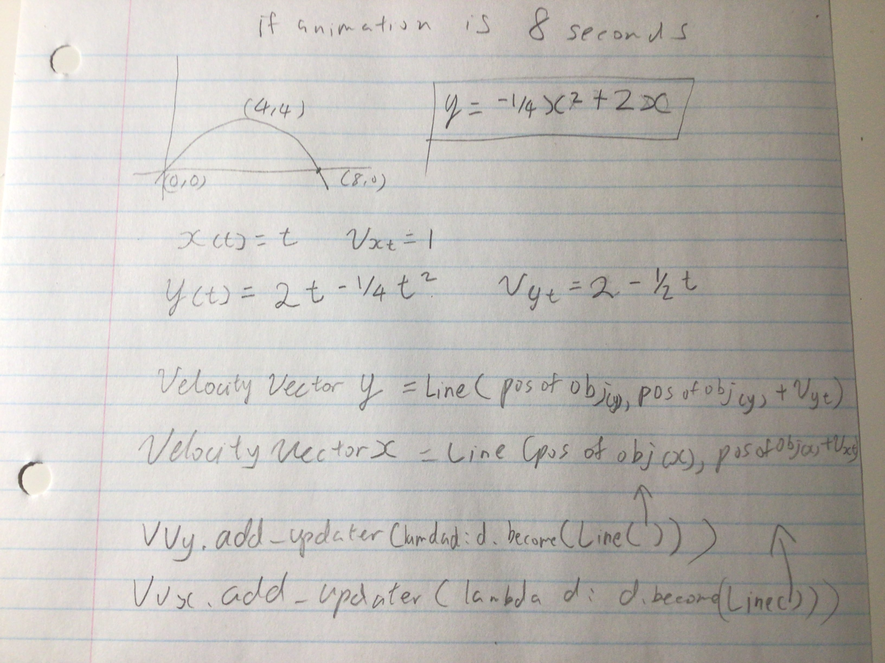

## Perceived trajectories of an object based on reference frames

### introduction

From the previous example we have discussed about how an observer in a reference frame that is moving at the same velocity as an object will appear stationary. Now, we are going to build on top of that and add another dimension to demonstrate projectile motion

> Animation: transform numberline into a cartesian plane or something, the 3rd and 4th quadrants will be barely present to give space for the things that are actually important

Let us now set up the problem. Just like before, we are going to have a stationary observer and a moving observer on a car with a ball. But, this time the ball is sitting on top of a cannon. 

> Animation: observers, car cannon (which can be represented by a rectangle) and ball are created

The car is moving at some constant velocity to the right and the ball will be launched upwards at some velocity and will be affected by a constant acceleration downwards due to gravity. 

Let's hit unpause and watch the ball fly through the air.

>  Animate ball being thrown into the air and follows a parabolic path. Bonus marks if the ball traces a parabolic path as well.

### Stationary perspective

Now, let's ask the stationary observer about the trajectory of the ball. 

> Animate: two component velocity vectors appear to indicate the different velocity of the ball, one in each direction

The stationary observer can say that the object is moving on a parabolic path, where the object moves at a constant velocity in the x direction and goes up, reaches a maximum point and then comes back down in the y direction.

### Moving perspective

However, the moving observer reports that the object only moves up and down. 

> Animate: the ball on a car only moving up and down.

As we have mentioned in the previous example, motion is relative. Since the car is moving at the same velocity in the horizontal direction as the projectile, the ball appears to not be moving horizontally to the moving observer. The only motion that the moving observer perceives is the vertical up and down motion.

> Animation which reference frame?

> animation: Motion is relative
Since motion is relative, both observations can be used depending on context. 

### Which Reference Frame?

As mentioned previously, motion is only meaningful if it is relative to something. In this situation, you can also choose your which observer's observations to use, either the stationary observer or the moving observer's observations regarding the position and velocity of the object can be used depending on the context.